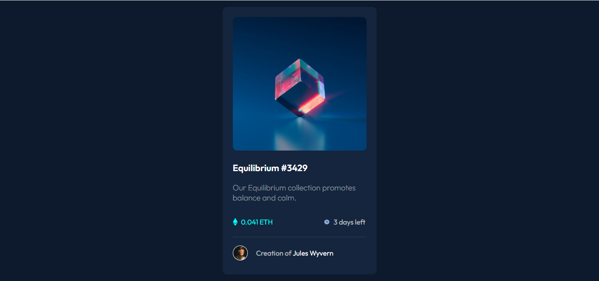

# Frontend Mentor - NFT preview card component

This is a solution to the [QR code component challenge on Frontend Mentor](https://www.frontendmentor.io/challenges/nft-preview-card-component-SbdUL_w0U). Frontend Mentor challenges help you improve your coding skills by building realistic projects.

## Table of contents

- [Overview](#overview)
  - [Screenshot](#screenshot)
  - [Links](#links)
- [My process](#my-process)
  - [Built with](#built-with)

## Overview

### Screenshot

### Links

- Solution URL: [Github](https://github.com/dnived/frontend-mentor-solution/tree/main/nft-preview-card-component-main)
- Live Site URL: [Github](https://dnived.github.io/frontend-mentor-solution/nft-preview-card-component-main/)

## My Process

### Built with

- HTML5
- CSS
